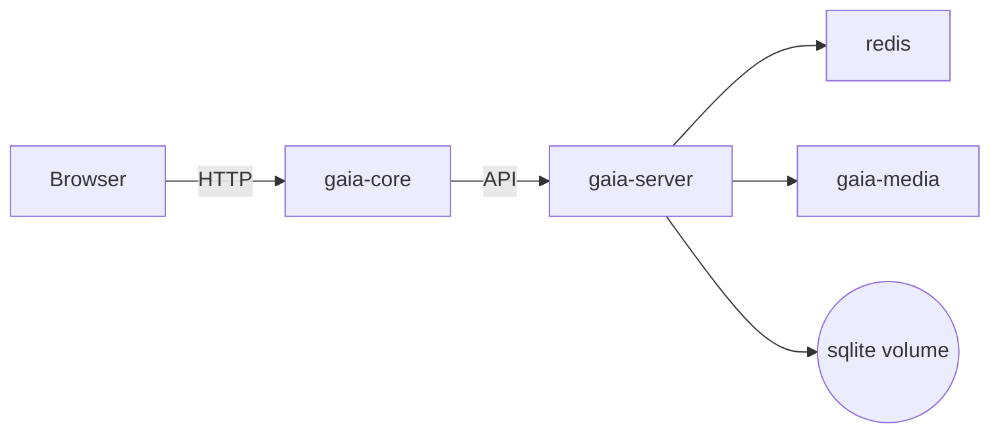

# GAIA - Arquitetura Inicial

Este diretório contém a documentação inicial da plataforma GAIA.

## Objetivo
Scaffold inicial com serviços: `gaia-core`, `gaia-server`, `gaia-media`, `redis`.

## Diagrama (Mermaid)



## Começando

1. Ajuste variáveis em `gaia-server/.env.example` e `gaia-core/.env.example`.
2. Iniciar com o compose de referência em `infra/gaia-compose.yml`:

```pwsh
docker compose -f infra/gaia-compose.yml up -d --build
```

## Notas
- Este é um scaffold inicial — conectores reais a APIs exigem credenciais e fluxos OAuth, por isso os adaptadores ficam nos diretórios do servidor (`gaia-server/src/adapters`).
